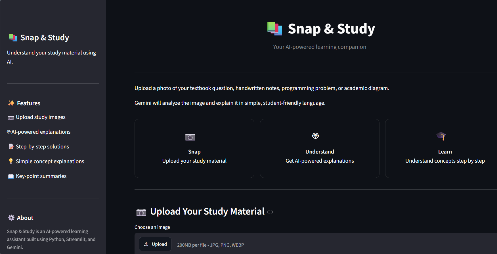
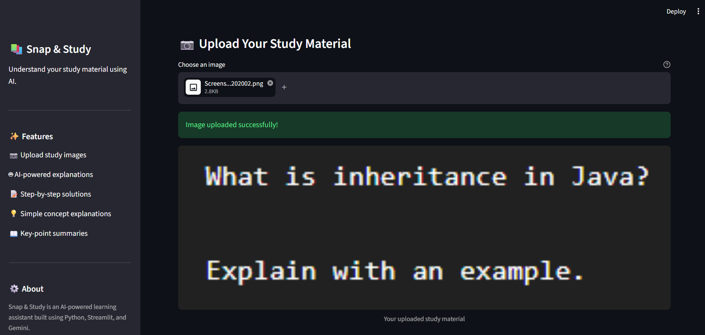
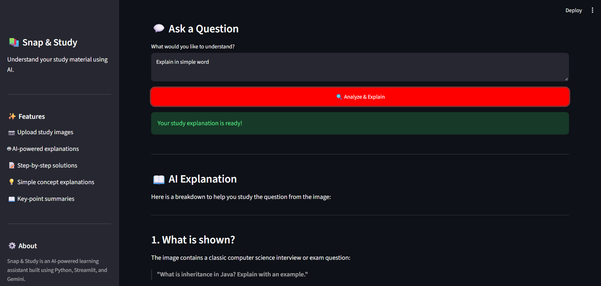
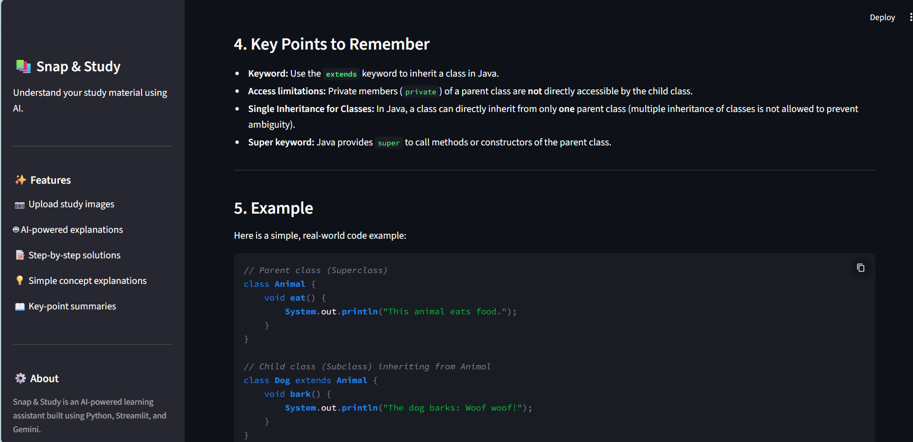
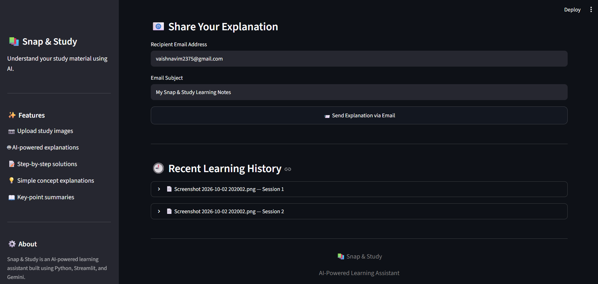
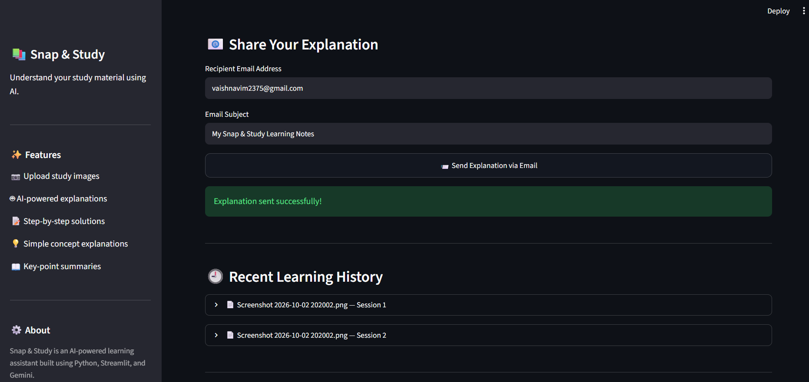
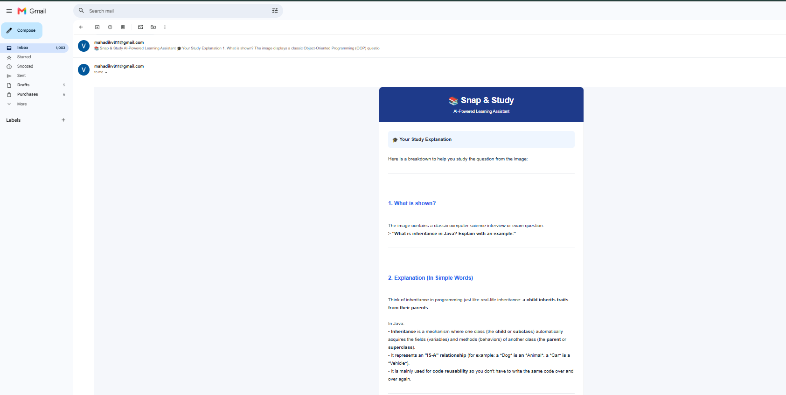

# 📚 Snap & Study

### AI-Powered Visual Learning Assistant

Snap & Study is an AI-powered educational web application that helps students understand questions, handwritten notes, diagrams, and other study material by simply uploading an image.

The application uses **Google Gemini's multimodal AI capabilities** to analyze uploaded study images and generate simple, structured, student-friendly explanations. Students can also download their generated explanations or share them directly through email.

---

## 📌 Problem Statement

Students often encounter difficult questions, diagrams, handwritten notes, or study material that require additional explanation.

Searching for each concept manually can be time-consuming, and available explanations may not always be easy to understand.

**Snap & Study** provides a simple solution:

> Upload study material → Ask a question → Get an AI-powered explanation → Save or share it.

---

## 🎯 Project Objective

The objective of Snap & Study is to build a simple AI-powered learning assistant that can:

- Analyze educational content from images.
- Explain concepts in simple language.
- Provide step-by-step solutions when applicable.
- Summarize important study points.
- Allow students to ask questions related to uploaded material.
- Allow generated explanations to be downloaded.
- Share generated study explanations through email.

---

## ✨ Features

### 📷 Study Image Upload

Students can upload study material in supported image formats such as:

- JPG
- JPEG
- PNG
- WEBP

The uploaded image is previewed inside the application before analysis.

### 🤖 AI-Powered Image Analysis

Snap & Study integrates with the **Google Gemini API** to analyze visual educational content.

The AI can help identify and explain:

- Questions
- Notes
- Diagrams
- Programming problems
- Academic concepts
- Other study material

### 📖 Structured Explanations

The application instructs the AI to organize explanations into useful learning sections such as:

1. What is shown?
2. Explanation
3. Step-by-step solution
4. Key points
5. Example

### 💬 Custom Student Questions

Students can enter an optional question along with the uploaded image.

For example:

```text
Explain this concept in very simple words.
```

or:

```text
Solve this question step by step.
```

This allows the generated response to focus on what the student specifically wants to understand.

### 📝 Step-by-Step Learning

When the uploaded image contains a problem or question, the AI is instructed to provide a step-by-step explanation rather than only returning a short answer.

### 📥 Download Explanation

Generated explanations can be downloaded as a Markdown file for later revision.

Example:

```text
snap_and_study_explanation.md
```

### 📧 Email Sharing

Students can send generated explanations directly to an email address.

The email functionality uses:

- Python `smtplib`
- Gmail SMTP
- SSL encryption
- Gmail App Password authentication

The generated Markdown response is converted into a styled HTML email for better readability.

### 🕘 Learning History

The application maintains recent learning interactions during the active Streamlit session.

Each history item contains:

- Uploaded filename
- Student question
- AI-generated explanation

> Learning history currently uses Streamlit Session State and is not permanently stored after the session ends.

### 🗑️ Clear History

Students can clear their current learning history directly from the sidebar.

### ⚠️ Error Handling

The application handles common API errors such as:

- Temporary Gemini service unavailability
- API rate limits
- Authentication problems
- Invalid or unavailable model errors
- Empty AI responses

Temporary service and rate-limit failures can also be retried automatically before an error is displayed.

---

# 🏗️ System Architecture

```text
                    ┌─────────────────────┐
                    │       Student       │
                    └──────────┬──────────┘
                               │
                               ▼
                    ┌─────────────────────┐
                    │   Streamlit Web UI  │
                    └──────────┬──────────┘
                               │
                    Upload Image + Question
                               │
                               ▼
                    ┌─────────────────────┐
                    │    Prompt Engine    │
                    │     prompts.py      │
                    └──────────┬──────────┘
                               │
                               ▼
                    ┌─────────────────────┐
                    │ Google Gemini API   │
                    │ Multimodal Analysis │
                    └──────────┬──────────┘
                               │
                               ▼
                    ┌─────────────────────┐
                    │ AI Explanation      │
                    └──────────┬──────────┘
                               │
                 ┌─────────────┼─────────────┐
                 ▼             ▼             ▼
             Display        Download       Email
             Result          Notes         Sharing
```

---

# 🔄 Application Workflow

```text
Upload Study Image
        ↓
Preview Image
        ↓
Enter Optional Question
        ↓
Click "Analyze & Explain"
        ↓
Build Learning Prompt
        ↓
Send Image + Prompt to Gemini
        ↓
Gemini Multimodal Analysis
        ↓
Generate Structured Explanation
        ↓
Display Explanation
        ↓
Save in Session History
        ↓
Download Notes / Share via Email
```

---

# 🛠️ Technology Stack

| Technology | Purpose |
|---|---|
| Python | Core programming language |
| Streamlit | Web application interface |
| Google Gemini API | Multimodal AI and image understanding |
| Google Gen AI Python SDK | Gemini API integration |
| HTML/CSS | UI and formatted email styling |
| Python `smtplib` | Sending emails |
| Gmail SMTP | Email delivery |
| Streamlit Session State | Temporary learning history |
| Git & GitHub | Version control and source-code hosting |

---

# 📁 Project Structure

```text
Snap-and-Study/
│
├── .streamlit/
│   ├── secrets.toml
│   └── secrets.toml.example
│
├── screenshots/
│   ├── analysis1.png
│   ├── analysis2.png
│   ├── email1.png
│   ├── email2.png
│   ├── email3.png
│   ├── home.png
│   └── upload.png
│
├── app.py
├── prompts.py
├── requirements.txt
├── .gitignore
├── README.md
└── LICENSE
```

### File Description

| File | Description |
|---|---|
| `app.py` | Main Streamlit application and application logic |
| `prompts.py` | System prompt and learning prompt configuration |
| `requirements.txt` | Python dependencies |
| `.gitignore` | Prevents secrets and unnecessary files from being committed |
| `secrets.toml.example` | Example configuration for required secrets |
| `README.md` | Project documentation |
| `LICENSE` | Project license |
| `screenshots/` | Application screenshots |

> `.streamlit/secrets.toml` contains private credentials and must never be committed to GitHub.

---

# 🚀 Local Installation

## 1. Clone the Repository

```bash
git clone https://github.com/VaishnaviMahadik23/snap-and-study.git
```

Move into the project:

```bash
cd Snap-and-Study
```

---

## 2. Create a Virtual Environment

### Windows

```powershell
python -m venv venv
```

Activate it:

```powershell
.\venv\Scripts\Activate.ps1
```

If PowerShell prevents activation:

```powershell
Set-ExecutionPolicy -Scope Process -ExecutionPolicy Bypass
.\venv\Scripts\Activate.ps1
```

---

## 3. Install Dependencies

```bash
pip install -r requirements.txt
```

---

# 🔐 Environment Configuration

Create:

```text
.streamlit/secrets.toml
```

Use `.streamlit/secrets.toml.example` as the template.

```toml
GEMINI_API_KEY = "your_gemini_api_key"

SMTP_EMAIL = "your_email@gmail.com"

SMTP_PASSWORD = "your_gmail_app_password"
```

## Gemini API Key

A Gemini API key is required for image analysis and AI-generated explanations.

Create/manage the API key through Google AI Studio.

## Gmail App Password

Email sharing uses Gmail SMTP authentication.

A Gmail App Password should be used instead of storing the normal Gmail account password in the application.

---

# ▶️ Run the Application

Start Streamlit:

```bash
streamlit run app.py
```

The application will normally be available locally at:

```text
http://localhost:8501
```

---

# 🧪 How to Use Snap & Study

### Step 1

Launch the application.

### Step 2

Upload an image containing your:

- Question
- Notes
- Diagram
- Programming problem
- Other study material

### Step 3

Optionally enter a question such as:

```text
Explain this in simple words with an example.
```

### Step 4

Click:

```text
🔍 Analyze & Explain
```

### Step 5

Read the generated explanation.

### Step 6

You can then:

- Review the explanation.
- Download the explanation.
- Send it through email.
- Review recent learning history.

---

# 📸 Screenshots

## 🏠 Home Page



The home page provides the image uploader, student question field, feature cards, and application navigation.

---

## 🤖 AI Study Explanation







The application analyzes uploaded study material and displays a structured explanation generated through the Gemini API.

---

## 📧 Email Sharing







Generated study explanations can be shared through professionally formatted HTML emails.

---

# 🔒 Security

Snap & Study follows basic secret-management practices.

Sensitive credentials are stored in:

```text
.streamlit/secrets.toml
```

The following file is excluded using `.gitignore`:

```text
.streamlit/secrets.toml
```

Only the safe example configuration is committed:

```text
.streamlit/secrets.toml.example
```

### Never commit:

- Gemini API keys
- Gmail App Passwords
- Other private credentials

If a credential is accidentally committed to a public repository, it should be revoked or rotated immediately.

---

# ☁️ Deployment

The application can be deployed using **Streamlit Community Cloud**.

For deployment:

1. Push the project to GitHub.
2. Connect the GitHub repository to Streamlit Community Cloud.
3. Select `app.py` as the application entry point.
4. Add the required secrets through Streamlit's deployment secret configuration.
5. Deploy the application.
6. Test image analysis and email functionality on the deployed version.

Private credentials should never be added directly to the GitHub repository.

---

# ⚠️ Current Limitations

- Gemini API availability and rate limits can affect AI responses.
- Image quality affects the accuracy of visual analysis.
- Very unclear or unreadable handwritten content may not be interpreted correctly.
- Learning history is session-based and is not permanently stored.
- Email sharing depends on valid SMTP configuration and provider availability.
- AI-generated explanations should be reviewed when used for important academic work.

---

# 🔮 Future Enhancements

Potential future improvements include:

- Persistent user accounts
- Permanent study history
- PDF study-material support
- Multiple-image analysis
- Voice-based questions
- Text-to-speech explanations
- Quiz generation
- Flashcard generation
- Automatic revision notes
- Multiple AI model support
- Database integration
- Study progress tracking
- Additional sharing options

---

# 🎓 Learning Outcomes

This project demonstrates practical experience with:

- Python application development
- Streamlit web development
- Multimodal Generative AI
- Prompt engineering
- Gemini API integration
- Image-based AI workflows
- Session-state management
- SMTP email integration
- HTML email formatting
- Secret management
- Error handling
- Git and GitHub
- AI application deployment

---

# 📄 License

This project is licensed under the **MIT License**.

See the `LICENSE` file for details.

---

# 👩‍💻 Author

**Vaishnavi Shivaji Mahadik**

B.Tech — Information Technology

### GitHub

[VaishnaviMahadik23](https://github.com/VaishnaviMahadik23)

---

## ⭐ Support

If you find this project useful, consider giving the repository a ⭐.

---

<p align="center">
  <strong>📚 Snap & Study</strong>
</p>

<p align="center">
  Snap. Understand. Learn.
</p>

<p align="center">
  Built with Python, Streamlit and Google Gemini
</p>